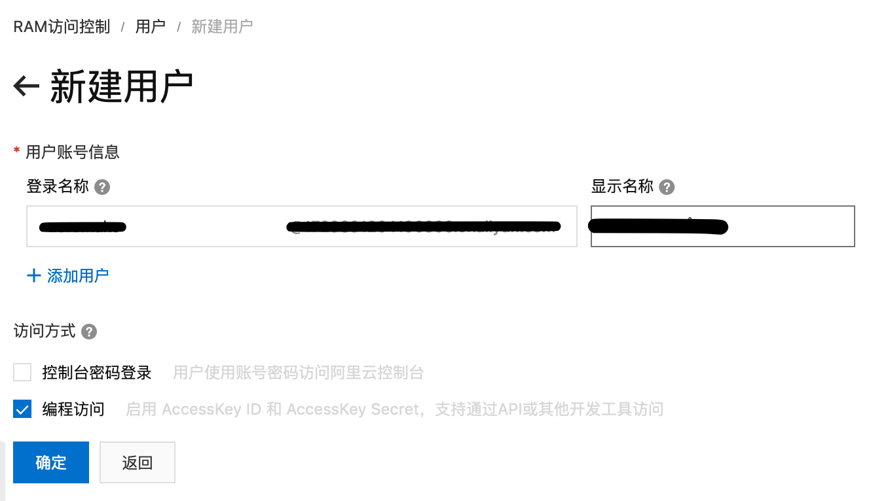
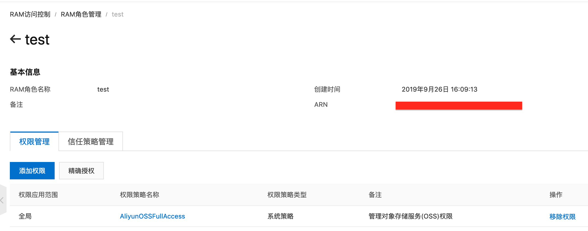
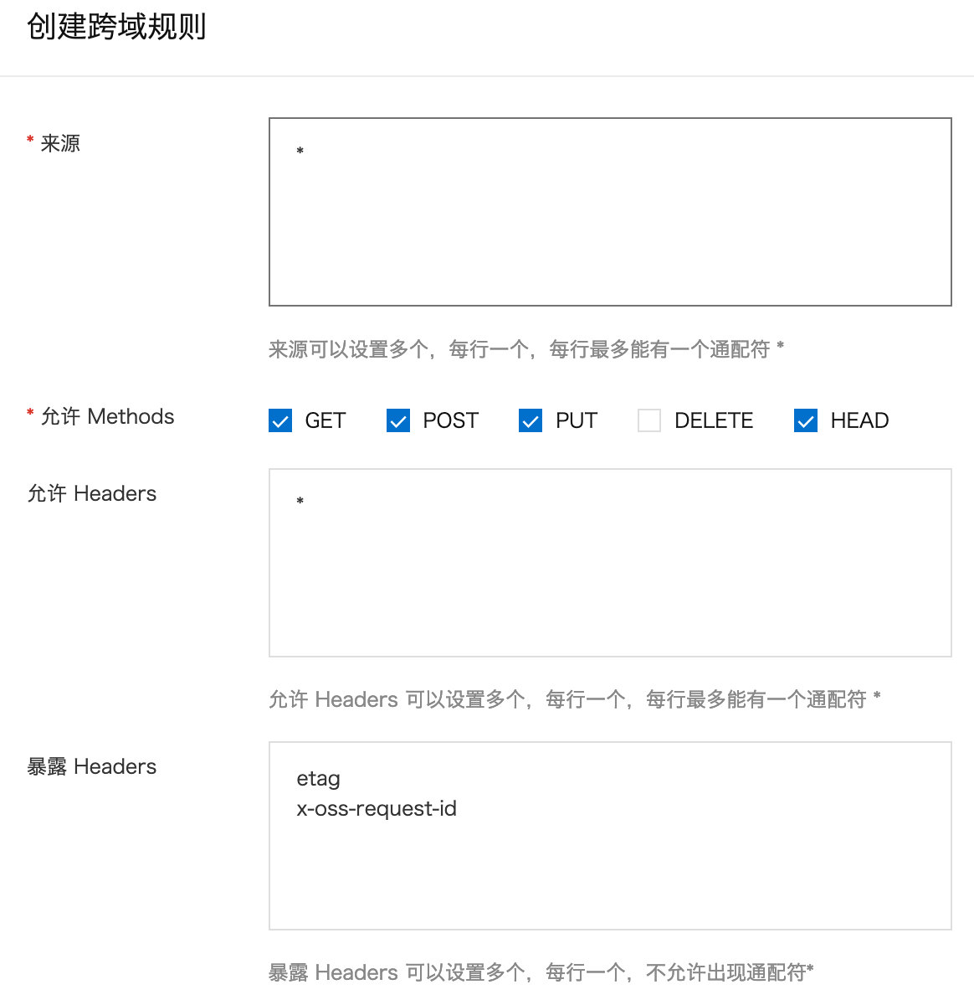

## 前言

- 最近正好工作上需要对阿里的 `oss` 的上传做断点上传的能力。
- 这边记录一下花了大把时间处理的一些难以排查的问题。

## 一、oss 帐号和角色配置

由于断点上传需要在上传过程中不断的请求接口，直接由后端生成认证签名（Authorization）是不行的了，`ali-oss` 这个库的断点上传的只支持 `sts` 认证方式，而 `sts` 认证不能直接用主帐号的 `AccessKey` 来访问，我们需要新建一个子帐号。

打开 [新建子帐号](https://ram.console.aliyun.com/users/new) 页面创建用户。



选择 **编程访问** 即可，并保存下 `AccessKeyID` 与 `AccessKeySecre`。

然后回到 [子用户列表页](https://ram.console.aliyun.com/users) 点击刚刚创建的用的 **添加权限** 来设置 `AliyunSTSAssumeRoleAccess` 的权限即可。

`sts` 授权需要一个角色来确定资源和 `oss` 的访问能力。

打开 [角色列表](https://ram.console.aliyun.com/roles) 新建一个角色，帐号选择不用选择到刚刚创建的子帐号。
然后添加 `AliyunOSSFullAccess` 权限代表 `oss` 的全部访问能力，不过如果有必要可以自定义一个 `oss` 访问能力的权限，创建完成后记得点击角色名到详情可以看到一个 `ARN`。




### 一些的解释

- 子用户的权限是用来创建 `sts` 认证的而不需要直接用来调用 `oss` 的访问能力，所以只需要设置 `AliyunSTSAssumeRoleAccess` 的权限。
- 角色的权限只需要 `oss` 访问能力，说明角色是用于分发后的 `sts` 的 `oss` 访问能力。
- 我查看了 [断点上传文档](https://helpcdn.aliyun.com/document_detail/31850.html) 上的接口说明的 `Authorization` 和 [签名构成文档](https://helpcdn.aliyun.com/document_detail/31951.html) 如果完全自己写应该是能够绕过 `ali-oss` 库必须要 `sts` 认证的问题。

## 二、跨域设置
打开 [oss控制台](https://oss.console.aliyun.com/overview) 选择左侧的 `bucket` 到 `基础设置 -> 跨域设置` 中按下图设置：




## 三、服务端sts接口开发

以下代码参考 [授权文档](https://help.aliyun.com/document_detail/120092.html)

``` js
const Koa = require('koa');
const Router = require('koa-router');
const OSS = require('ali-oss');
const serve = require('koa-static-server');
const STS = OSS.STS;

const app = new Koa();

const router = new Router();

const conf = {
    AccessKeyId: '',
    AccessKeySecret: '',
    // 角色 arn
    RoleArn: '',
    // 地区 sdk 会根据这个获取到正确的仓库地址
    region: '',
    // oss 仓库
    bucket: ''
};

const sts = new STS({
    accessKeyId: conf.AccessKeyId,
    accessKeySecret: conf.AccessKeySecret
});


router.post('/api/sts', async (ctx, next) => {
    const body = ctx.request.body;
    const key = body.key;
    // 可以限制到文件访问能力
    const policy = {
        Version: '1',
        Statement: [
            {
                // 开放所有 oss 访问能力
                Action: 'oss:*',
                Effect: 'Allow',
                // 可以访问的对象，这里限制到文件级别
                Resource: `acs:oss:*:*:${conf.bucket}/${key}`
            }
        ]
    };

    // 最后一个参数为过期时间
    const token = await sts.assumeRole(conf.RoleArn, policy, 3600);
    ctx.body = {
        region: conf.region,
        bucket: conf.bucket,
        // 文件名可以通过后端进行一些处理，比如固定到某文件夹下，文件名由后端生成
        key,
        // 下面是前端 ali-oss 需要的一些认证配置
        accessKeyId: token.credentials.AccessKeyId,
        accessKeySecret: token.credentials.AccessKeySecret,
        stsToken: token.credentials.SecurityToken,
    };
});

// 挂载前端测试
app.use(serve({rootDir: './'}));

app
  .use(router.routes())
  .use(router.allowedMethods());


module.exports = app;

if(require.main === module) {
    app.listen(8000, '0.0.0.0', () => {
        console.log('open: http://localhost:8000');
    });
}

```

## 四、前端示例代码
参考 [上传示例](https://help.aliyun.com/document_detail/64047.html)

``` html
<!DOCTYPE html>
<html lang="en">
<head>
    <meta charset="UTF-8">
    <meta name="viewport" content="width=device-width, initial-scale=1.0">
    <meta http-equiv="X-UA-Compatible" content="ie=edge">
    <title>oss-upload</title>
    <script src="/node_modules/ali-oss/dist/aliyun-oss-sdk.js"></script>
</head>
<body>
    <div>
        <input type="file" id="file"/>
    </div>
    <script>
        document.getElementById('file').addEventListener('change', (e) => {
            const file = e.target.files[0];

            // 选择文件就调用 sts
            return fetch(`/api/sts?key=${file.name}`, {
                method: 'POST',
                headers: {
                    "Content-Type": "application/json"
                }
            }).then(resp => {
                return resp.json();
            }).then(data => {
                const ossConfig = {
                    region: data.region,
                    accessKeyId: data.accessKeyId,
                    accessKeySecret: data.accessKeySecret,
                    bucket: data.bucket,
                    stsToken: data.stsToken,
                    // endpoint 和 cname 是用来设置自定义接口域名的
                    // endpoint: `${location.protocol}${data.action}`,
                    // cname: true,
                };
                const client = new OSS(ossConfig);

                // 这个 api 会自动的对文件分片上传并调用完成进行合成。
                return client.multipartUpload(data.key, file, {
                    progress(p, checkpoint) {
                        // p 为 0 - 1 的进度, checkpoint 用于断开上传后的续传能力
                        console.log(p);
                    },
                }).then((resp) => {
                    // 最后会返回上传后的url
                    console.log(resp);
                });
            });
        });
    </script>
</body>
</html>
```

## 五、出现错误的排查

### sts 接口调用失败

- 子帐号未授权 `AliyunSTSAssumeRoleAccess`, 会报 `You are not authorized to do this action. You should be authorized by RAM.`。
- 角色未授权 `oss` 访问能力，会报 `You are not authorized to do this action. You should be authorized by RAM.`。
- 请求 `sts` 的 `policy` 格式不对也会报错。
- 还有 `policy` 的权限能力超过角色的权限也会报错。

### 前端调用失败

- `options` 请求出现 `403`，请检查对应 `bucket` 的跨域设置，需要勾选 `GET, POST, PUT, HEAD` 这几个方法，暴露出 `etag` Header，还有允许的 Header 也需要设置。
- 断点上传的初始化和分片上传都没问题，但是合成接口的 `ETag` 都是 `undefined`，这个就是上面说的 `bucket` 的 暴露 Header 没设置。
- 以上都设置还是会出现，需要检查一下是否使用了自定义的 `cdn` 域名来跨域上传，如果有需要去查看 `cdn` 域名配置的 Header 是否有重写，或者说是使用了代理。
- 还有就是 `oss` 操作能力没有开放足够，又或者说是设置了只能往固定 key 写的文件，跑到其它地方了。
